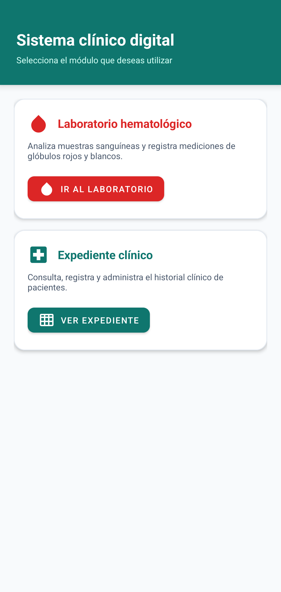
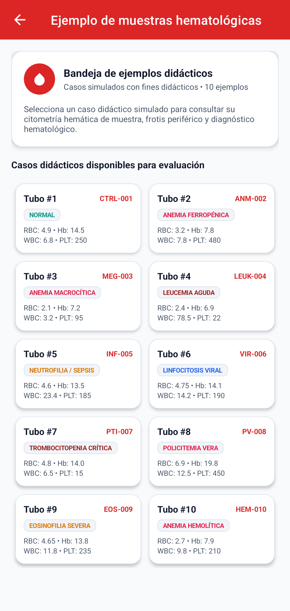
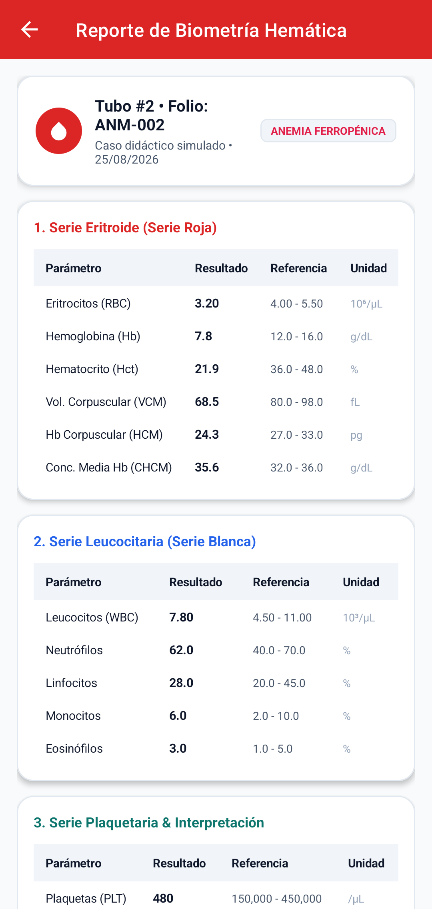
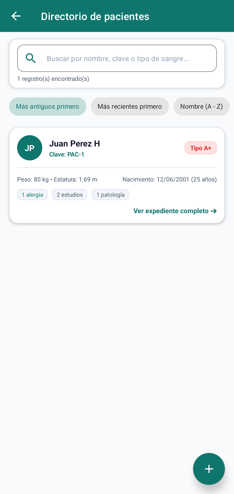

# Sistema Clínico

Aplicación Android desarrollada como proyecto universitario.

> **Aviso:** este proyecto tiene fines educativos y prácticos. Las muestras incluidas corresponden a casos didácticos simulados y no representan datos de pacientes reales ni sustituyen el criterio médico profesional.

## Descripción

La aplicación es un sistema de gestión clínica y laboratorio hematológico para Android que nació como un proyecto final universitario y fue posteriormente ampliado y mejorado. Permite administrar expedientes médicos de pacientes de manera local, evaluar citometrías hemáticas (serie roja, serie blanca y serie plaquetaria), calcular índices eritrocitarios automáticamente, procesar archivos de mediciones (CSV y TXT) y exportar reportes clínicos en formato PDF.

## Capturas de pantalla

<table align="center">
  <tr>
    <td align="center">
      <br>
      <em>Imagen 1. Menú principal</em>
    </td>
    <td align="center">
      <br>
      <em>Imagen 2. Bandeja de muestras didácticas</em>
    </td>
  </tr>
  <tr>
    <td align="center">
      <br>
      <em>Imagen 3. Reporte de biometría e interpretación</em>
    </td>
    <td align="center">
      <br>
      <em>Imagen 4. Directorio de pacientes</em>
    </td>
  </tr>
</table>

## Características

Incluye funciones para:

- Gestión de expedientes clínicos de pacientes con clave identificadora, datos generales, medidas antropométricas y sexo biológico.
- Catálogo y registro de alergias asociadas al paciente, con niveles de severidad, síntomas y tratamiento de rescate.
- Seguimiento histórico de conteos de glóbulos rojos (GR) y glóbulos blancos (GB).
- Registro de diagnósticos y tratamientos oncológicos por paciente.
- Laboratorio hematológico con bandeja de 10 casos didácticos simulados para evaluación de patologías frecuentes y críticas.
- Interpretación analítica completa de biometría hemática:
  - Serie roja: eritrocitos (RBC), hemoglobina (Hb), hematocrito (Hct), VCM, HCM y CHCM.
  - Serie blanca: leucocitos totales (WBC), neutrófilos, linfocitos, monocitos y eosinófilos.
  - Serie plaquetaria: recuento de plaquetas (PLT).
- Cálculo automático de fórmulas hematológicas e índices eritrocitarios con base en rangos biológicos.
- Carga y procesamiento de archivos CSV y TXT con datos de mediciones hematológicas.
- Creación de copias locales de seguridad de los archivos importados para evitar la pérdida o modificación del archivo original.
- Historial de análisis de archivos con opción de vincular directamente los resultados al expediente de cualquier paciente.
- Exportación de reportes clínicos individuales en formato PDF.
- Búsqueda y filtrado en tiempo real dentro del directorio de pacientes y tablas clínicas.
- Base de datos local SQLite con integridad referencial y eliminación en cascada para evitar registros huérfanos.
- Modo offline 100% funcional sin necesidad de conexión a Internet ni servicios externos.

## Tecnologías

- Kotlin.
- Android Studio.
- AndroidX y Material Components.
- View Binding.
- SQLite local (SQLiteOpenHelper).
- OpenCSV.
- JUnit 4 y Espresso.

## Requisitos

- Android Studio Iguana (2023.2.1) o superior.
- JDK 17 o superior (incluido en Android Studio).
- Android SDK con soporte para `compileSdk 37` y `minSdk 24` (Android 7.0 o superior).
- Dispositivo físico o emulador con Android 7.0 o superior.

## Ejecución del proyecto

1. Clonar el repositorio:
   ```bash
   git clone https://github.com/wTavo/Sistema-Clinico.git
   ```
2. Abrir Android Studio y seleccionar **Open**.
3. Navegar hasta la carpeta clonada y seleccionarla.
4. Esperar a que Gradle sincronice todas las dependencias del proyecto.
5. Seleccionar un emulador o dispositivo físico conectado.
6. Presionar el botón **Run** (`Shift + F10`) para compilar e instalar la aplicación.

## Pruebas y compilación

- Para ejecutar las pruebas unitarias locales:
  ```bash
  ./gradlew test
  ```
- Para compilar el APK en modo Debug:
  ```bash
  ./gradlew assembleDebug
  ```
- Para compilar el APK en modo Release:
  ```bash
  ./gradlew assembleRelease
  ```

## Estructura del proyecto

```text
java/com/example/sistemaclinico/
├── data/
│   ├── DatabaseHelper.kt        # Gestor SQLite nativo, esquemas DDL y operaciones CRUD
│   └── PatientProfile.kt        # Modelos consolidados para expedientes y reportes
├── ui/
│   ├── clinical/
│   │   ├── ClinicalMenuActivity.kt        # Menú de opciones del expediente clínico
│   │   ├── ClinicalRecordInsertActivity.kt        # Formulario de registro de datos clínicos
│   │   ├── ClinicalTablesMenuActivity.kt        # Menú de consulta de tablas clínicas
│   │   ├── ClinicalTableViewerActivity.kt        # Visor interactivo y buscador de tablas
│   │   ├── PatientAdapter.kt        # Adaptador de tarjetas para directorio de pacientes
│   │   ├── PatientDetailActivity.kt        # Detalle integral del expediente del paciente
│   │   ├── PatientDetailDialogManager.kt        # Gestor modular de diálogos clínicos del expediente
│   │   └── PatientDirectoryActivity.kt        # Directorio y búsqueda de pacientes
│   ├── hematology/
│   │   ├── HematologyDataEntryActivity.kt        # Carga, análisis y gestión de archivos CSV/TXT
│   │   ├── HematologyMenuActivity.kt        # Menú principal del laboratorio hematológico
│   │   ├── HematologyResultsActivity.kt        # Reporte de resultados de biometría hemática
│   │   └── HematologySamplesActivity.kt        # Bandeja de muestras clínicas didácticas
│   └── main/
│       └── MainActivity.kt        # Menú principal de la aplicación
└── utils/
    ├── DateMaskTextWatcher.kt        # Máscara y validación de formato de fecha
    ├── InputUtils.kt        # Utilidades de saneamiento de texto y entradas
    └── PdfReportGenerator.kt        # Generador de reportes clínicos en PDF
```
